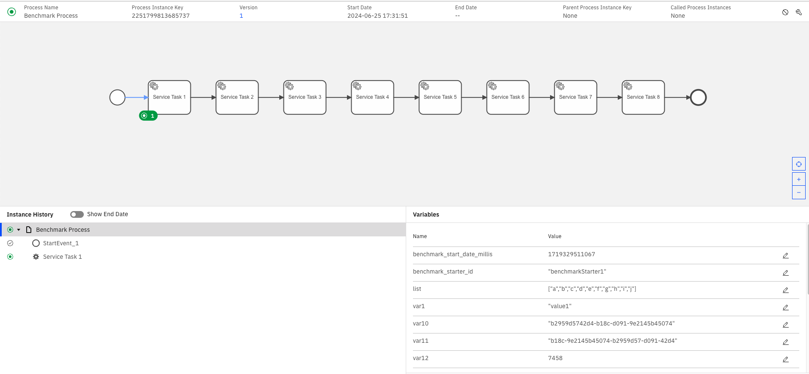
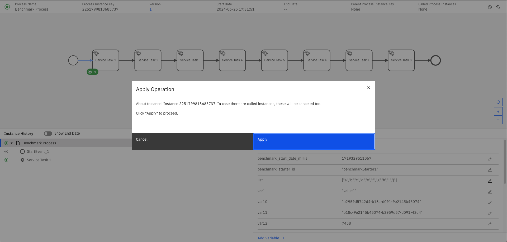

# Trigger Backup and Restore

## Create Demo Environment

### 1. Create Minio

```bash
helm install minio oci://registry-1.docker.io/bitnamicharts/minio -f minio-values.yaml
```
[minio-values.yaml](minio-values.yaml)
<details>

<p style="color: powderblue; font-size: 14px"> minio-values.yaml </p>

```text

auth:
  rootUser: minioadmin
  rootPassword: minioadmin

defaultBuckets: zeebe-backup,operate-backup,tasklist-backup,optimize-backup

```

</details>

---


### 2. Install Camunda

```bash
helm install camunda camunda/camunda-platform -f camunda-values.yaml --version 10.4.0
```
[camunda-values.yaml](camunda-values.yaml)

---

### 3. Wait for ES to be ready
```bash
kubectl rollout status sts/camunda-elasticsearch-master
kubectl rollout status --watch --timeout=600s sts/camunda-elasticsearch-master
kubectl wait pods --all --for=condition=ready
```

---

### 4. Register Snapshot Repositories
```bash
kubectl apply -f es-snapshot-minio-job.yaml
```

[es-snapshot-minio-job.yaml](es-snapshot-minio-job.yaml)

---

Check the logs: 

```bash
kubectl logs -f $(kubectl get pods --selector=job-name=es-snapshot-minio-job --output=jsonpath='{.items[*].metadata.name}' | awk '{print $1}') 
```

---

### 5. Generate Data

* 5-a. Create bmpn as configmap

```bash
kubectl create configmap models --from-file=CamundaProcess.bpmn=./backup/BenchmarkProcess.bpmn
```
[./backup/BenchmarkProcess.bpmn](./backup/BenchmarkProcess.bpmn)

***

* 5-b. Deploy pbmn to camunda.

```bash
kubectl apply -f ./backup/zbctl-deploy-job.yaml 
```
[zbctl-deploy-job.yaml](./backup/zbctl-deploy-job.yaml)

***

```bash
kubectl logs -f $(kubectl get pods --selector=job-name=zbctl-deploy --output=jsonpath='{.items[*].metadata.name}' | awk '{print $1}') 
```

***

```bash
kubectl create configmap payload --from-file=./backup/payload.json
```
[./backup/payload.json](./backup/payload.json)

***

```bash
kubectl apply -f ./backup/benchmark.yaml
kubectl wait --for=condition=ready pod -l app=benchmark
sleep 30
kubectl delete -f ./backup/benchmark.yaml
```
[./backup/benchmark.yaml](./backup/benchmark.yaml)

***

### Review Current State


## Perform Backup
### Generate BackupId
```bash
./backup/create-backupId-as-secret.sh
```
[./backup/create-backupId-as-secret.sh][def]

***

### Trigger Backup for Operate, Tasklist and Optimize

```bash
kubectl apply -f ./backup/camunda-backup-job.yaml
```
[./backup/camunda-backup-job.yaml][def]
***

```bash
kubectl logs -f $(kubectl get pods --selector=job-name=camunda-backup-job --output=jsonpath='{.items[*].metadata.name}' | awk '{print $1}') 
```

***

### Pause Exporting

```bash
kubectl apply -f ./backup/zeebe-export-pause.yaml
```
[./backup/zeebe-export-pause.yaml][def]
*** 

### Backup of Zeebe Records in ES
```bash
kubectl apply -f ./backup/es-create-snapshot-zeebe.yaml
```
[./backup/es-create-snapshot-zeebe.yaml][def]
***

```bash
kubectl logs -f $(kubectl get pods --selector=job-name=es-create-snapshot-zeebe --output=jsonpath='{.items[*].metadata.name}' | awk '{print $1}') 
```
***

### Zeebe Backup
```bash
kubectl apply -f ./backup/zeebe-backup-job.yaml
```

[./backup/zeebe-backup-job.yaml][def]


```bash
kubectl logs -f $(kubectl get pods --selector=job-name=zeebe-backup-job --output=jsonpath='{.items[*].metadata.name}' | awk '{print $1}') 
```
***

### (Optional not required for the Demo) Resume Exporting

```bash
kubectl apply -f ./backup/zeebe-export-resume.yaml
```
[./backup/zeebe-export-resume.yaml][def]

***

## Simulate Data Loss

```bash
helm delete camunda
```
***

```bash
kubectl delete pvc data-camunda-elasticsearch-master-0 data-camunda-elasticsearch-master-1 data-camunda-postgresql-0 data-camunda-zeebe-0 data-camunda-zeebe-1 data-camunda-zeebe-2
```
***


## Restore
### Create New Camunda Cluster

```bash
helm install camunda camunda/camunda-platform -f camunda-values.yaml --version 10.4.0
```
[camunda-values.yaml][def]

***

```bash
kubectl rollout status deploy/camunda-operate
kubectl rollout status --watch --timeout=600s deploy/camunda-operate

```

Why? Templates and Aliases are created again.

### Verify that Templates are generated.


### Scale Down Zeebe & Webapps.
```bash
kubectl scale sts/camunda-zeebe --replicas=0
kubectl scale deploy/camunda-zeebe-gateway --replicas=0
kubectl scale deploy/camunda-operate --replicas=0
kubectl scale deploy/camunda-tasklist --replicas=0
kubectl scale deploy/camunda-optimize --replicas=0
```

*** 

### Register ES Repositories again

```bash
kubectl delete -f es-snapshot-minio-job.yaml
kubectl apply -f es-snapshot-minio-job.yaml
```

[es-snapshot-minio-job.yaml](es-snapshot-minio-job.yaml)

***
### Delete all Indices
```bash
kubectl apply -f restore/es-delete-all-indices.yaml
```
[restore/es-delete-all-indices.yaml](restore/es-delete-all-indices.yaml)
****
### Restore Snapshots
```bash
kubectl apply -f restore/es-snapshot-restore-job.yaml
```
[restore/es-snapshot-restore-job.yaml](restore/es-snapshot-restore-job.yaml)

### Restore Zeebe
```bash
kubectl apply -f restore/zeebe-restore-job-0.yaml
```
[restore/zeebe-restore-job-0.yaml](restore/zeebe-restore-job-0.yaml)

```bash
kubectl logs -f $(kubectl get pods --selector=job-name=zeebe-restore-job-0 --output=jsonpath='{.items[*].metadata.name}' | awk '{print $1}') 
```

```bash
kubectl apply -f restore/zeebe-restore-job-1.yaml
```
[restore/zeebe-restore-job-1.yaml](restore/zeebe-restore-job-1.yaml)
```bash
kubectl logs -f $(kubectl get pods --selector=job-name=zeebe-restore-job-1 --output=jsonpath='{.items[*].metadata.name}' | awk '{print $1}') 
```

```bash
kubectl apply -f restore/zeebe-restore-job-2.yaml
```
[restore/zeebe-restore-job-2.yaml](restore/zeebe-restore-job-2.yaml)
```bash
kubectl logs -f $(kubectl get pods --selector=job-name=zeebe-restore-job-2 --output=jsonpath='{.items[*].metadata.name}' | awk '{print $1}') 
```

```bash
kubectl delete jobs zeebe-restore-job-0 zeebe-restore-job-1 zeebe-restore-job-2
```

### Scale up Zeebe again
```bash
kubectl scale sts/camunda-zeebe --replicas=3
```

```bash
kubectl rollout status sts/camunda-zeebe
kubectl rollout status --watch --timeout=600s sts/camunda-zeebe
```

```bash
kubectl scale deploy/camunda-zeebe-gateway --replicas=1
kubectl rollout status --watch --timeout=600s deploy/camunda-zeebe-gateway
```

```bash
kubectl port-forward svc/camunda-zeebe-gateway 26500
```

```bash
zbctl status --insecure
```

### Scale up Operate again
```bash
kubectl scale deploy/camunda-operate --replicas=1
kubectl rollout status --watch --timeout=600s deploy/camunda-operate
```
### Scale up Tasklist again
```bash
kubectl scale deploy/camunda-tasklist --replicas=1
kubectl rollout status --watch --timeout=600s deploy/camunda-tasklist
```
### Scale up Optimize again
```bash
kubectl scale deploy/camunda-optimize --replicas=1
kubectl rollout status --watch --timeout=600s deploy/camunda-optimize
```

# Validate Restore

## Operate:


## Zeebe:
### Find an active Instance



### Cancel it via Operate UI



### Validate Cancellation


# Cleanup
```bash
helm uninstall camunda
```

```bash
helm uninstall minio
```

```bash
kubectl delete jobs $(kubectl get jobs --no-headers -o custom-columns=":metadata.name,:status.conditions[?(@.type=='Complete')].status" | grep True | cut -d" " -f1)
```
```bash
kubectl delete pvc data-camunda-elasticsearch-master-0 data-camunda-elasticsearch-master-1 data-camunda-postgresql-0 data-camunda-zeebe-0 data-camunda-zeebe-1 data-camunda-zeebe-2 minio
```


[def]: ./backup/create-backupId-as-secret.sh