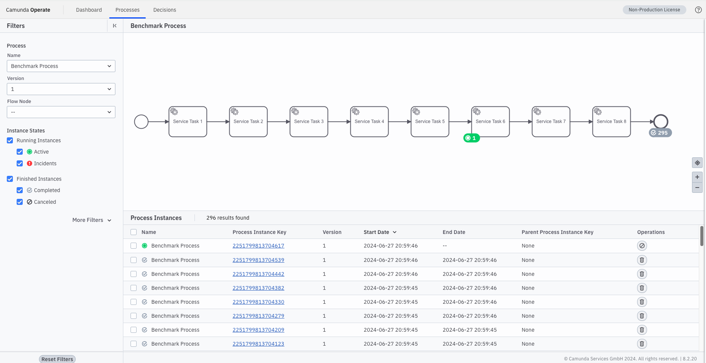
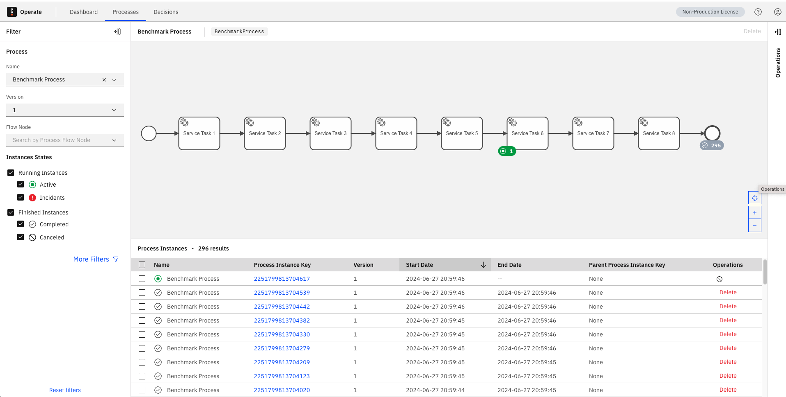
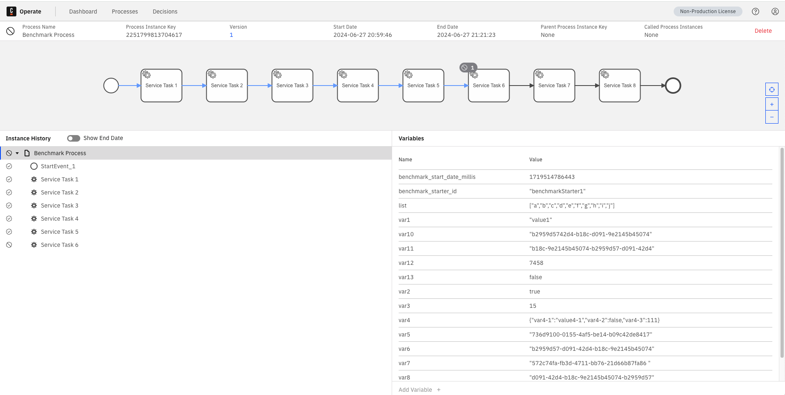

# Example Upgrade path for Camunda 8.2 -> 8.5


# Install Camunda 8.2.20 with Elasticsearch 7.17.15 and sample data
Helm Chart used: https://artifacthub.io/packages/helm/camunda/camunda-platform/8.2.20

## Install Camunda 8.2.20
```bash
helm install --namespace camunda camunda camunda/camunda-platform -f ./Camunda8.2.20-with-ES7.17.15-values.yaml --version 8.2.20 --create-namespace
```

## Create sample data

```bash
kubectl create configmap models --from-file=CamundaProcess.bpmn=./resources/BenchmarkProcess.bpmn
```

```bash
kubectl apply -f ./resources/zbctl-deploy-job.yaml 
```

```bash
kubectl logs -f $(kubectl get pods --selector=job-name=zbctl-deploy --output=jsonpath='{.items[*].metadata.name}' | awk '{print $1}') 
```

```bash
kubectl create configmap payload --from-file=./resources/payload.json
```

```bash
kubectl apply -f ./resources/benchmark.yaml
```

```bash
kubectl delete deploy benchmark
```

## Check state in Operate



# Upgrade Camunda 8.2.20 to 8.3.3
Docs: https://docs.camunda.io/docs/self-managed/operational-guides/update-guide/820-to-830/  
Docs: https://docs.camunda.io/docs/self-managed/setup/upgrade/#from-camunda-82-to-83

## Update deprecated Elasticsearch properties
```bash
kubectl set env statefulset/elasticsearch-master node.roles='data','ingest','master','remote_cluster_client','ml'

kubectl set env statefulset/elasticsearch-master node.data-
kubectl set env statefulset/elasticsearch-master node.ingest-
kubectl set env statefulset/elasticsearch-master node.master-
kubectl set env statefulset/elasticsearch-master node.remote_cluster_client-
kubectl set env statefulset/elasticsearch-master node.ml-
```

## Data Retention in ES
Option Two: Update PVs manually, see https://docs.camunda.io/docs/self-managed/platform-deployment/helm-kubernetes/upgrade/#elasticsearch---data-retention

```bash
ES_PV_NAME0="$(kubectl get pvc elasticsearch-master-elasticsearch-master-0 -o jsonpath='{.spec.volumeName}')"
ES_PV_NAME1="$(kubectl get pvc elasticsearch-master-elasticsearch-master-1 -o jsonpath='{.spec.volumeName}')"
kubectl patch pv "${ES_PV_NAME0}" -p '{"spec":{"persistentVolumeReclaimPolicy":"Retain"}}'
kubectl patch pv "${ES_PV_NAME1}" -p '{"spec":{"persistentVolumeReclaimPolicy":"Retain"}}'
```

```bash
kubectl scale statefulset elasticsearch-master --replicas 0
```

```bash
kubectl delete pvc elasticsearch-master-elasticsearch-master-0
kubectl delete pvc elasticsearch-master-elasticsearch-master-1
```

### Edit elasticsearch-master PVs


# Remove resourceVersion and UUID from claimRef

```bash
  PV_JSON=$(kubectl get pv "$PV_NAME" -o json | \
    jq 'del(.metadata.resourceVersion) | del(.spec.claimRef.resourceVersion) | del(.spec.claimRef.uid)')
  TEMP_FILE=$(mktemp)
  echo "$PV_JSON" > "$TEMP_FILE"
  echo "Replacing PersistentVolume: $PV_NAME"
  kubectl replace -f "$TEMP_FILE"
  rm "$TEMP_FILE"

  # Edit claimRef to point to the new PVC
  NEW_PVC_NAME="data-${HELM_RELEASE_NAME}-${STATEFULSET_NAME}-${i}"
  echo "Updating claimRef to new PVC: $NEW_PVC_NAME"
  kubectl patch pv "$PV_NAME" -p "{\"spec\":{\"claimRef\":{\"name\":\"$NEW_PVC_NAME\"}}}"
```

### actual upgrade

```bash
kubectl -n camunda delete deployment camunda-operate
kubectl -n camunda delete deployment camunda-tasklist
kubectl -n camunda delete deployment camunda-zeebe-gateway
kubectl -n camunda delete statefulset camunda-zeebe
```

```bash
helm upgrade -f ./Camunda8.3.3-with-ES8.8.2-values.yaml camunda camunda/camunda-platform --version 8.3.3
```


# Upgrade Camunda 8.3.3 to 8.4.0
Docs: https://docs.camunda.io/docs/self-managed/operational-guides/update-guide/830-to-840/  
Docs: https://docs.camunda.io/docs/self-managed/setup/upgrade/#from-camunda-83-to-84

```bash
helm upgrade -f ./Camunda8.4.0-with-ES8.9.2-values.yaml  camunda camunda/camunda-platform --version 9.3.4
```


# Upgrade Camunda 8.4.0 to 8.5.
Docs: https://docs.camunda.io/docs/self-managed/operational-guides/update-guide/840-to-850/  
Docs: https://docs.camunda.io/docs/self-managed/setup/upgrade/#from-camunda-84-to-85


```bash
helm upgrade -f ./Camunda8.5.0-with-ES8.13.0-values.yaml  camunda camunda/camunda-platform --version 10.0.2
```


# Verification
## Operate still shows correct data (verifies Operate/Elasticsearch data is correct)  

  
## Instance can be cancelled (verifies also Zeebe data is correct and matches Operate/Elasticsearch)  



## Complete Script for 8.2 > 8.3 Upgrade Preperation:

Make PVs bind to new Elastic PVCs
```bash
#!/bin/bash

# Variables
NAMESPACE="default" # Change this to your target namespace
STATEFULSET_NAME="elasticsearch-master"
HELM_RELEASE_NAME="camunda" # Helm release name

# Update deprecated Elasticsearch properties
echo "Updating Elasticsearch properties..."
kubectl -n "$NAMESPACE" set env statefulset/"$STATEFULSET_NAME" node.roles='data','ingest','master','remote_cluster_client','ml'

kubectl -n "$NAMESPACE" set env statefulset/"$STATEFULSET_NAME" node.data-
kubectl -n "$NAMESPACE" set env statefulset/"$STATEFULSET_NAME" node.ingest-
kubectl -n "$NAMESPACE" set env statefulset/"$STATEFULSET_NAME" node.master-
kubectl -n "$NAMESPACE" set env statefulset/"$STATEFULSET_NAME" node.remote_cluster_client-
kubectl -n "$NAMESPACE" set env statefulset/"$STATEFULSET_NAME" node.ml-

# Data retention in ES - Update PVs dynamically
echo "Updating PersistentVolume ReclaimPolicy and cleaning up PVCs..."

# Get the number of replicas (pods) in the StatefulSet
REPLICAS=$(kubectl -n "$NAMESPACE" get statefulset "$STATEFULSET_NAME" -o jsonpath='{.spec.replicas}')

# Scale down the StatefulSet
echo "Scaling down the StatefulSet..."
kubectl -n "$NAMESPACE" scale statefulset "$STATEFULSET_NAME" --replicas=0

# Loop through each replica and update its PV
for ((i=0; i<REPLICAS; i++)); do
  PVC_NAME="${STATEFULSET_NAME}-${STATEFULSET_NAME}-${i}"
  PV_NAME=$(kubectl -n "$NAMESPACE" get pvc "$PVC_NAME" -o jsonpath='{.spec.volumeName}')
  
  echo "Patching PV: $PV_NAME"
  kubectl patch pv "$PV_NAME" -p '{"spec":{"persistentVolumeReclaimPolicy":"Retain"}}'
  
  echo "Modifying PersistentVolume: $PV_NAME"
  
  # Remove resourceVersion and UUID from claimRef
  PV_JSON=$(kubectl get pv "$PV_NAME" -o json | \
    jq 'del(.metadata.resourceVersion) | del(.spec.claimRef.resourceVersion) | del(.spec.claimRef.uid)')
  TEMP_FILE=$(mktemp)
  echo "$PV_JSON" > "$TEMP_FILE"
  echo "Replacing PersistentVolume: $PV_NAME"
  kubectl replace -f "$TEMP_FILE"
  rm "$TEMP_FILE"

  # Edit claimRef to point to the new PVC
  NEW_PVC_NAME="data-${HELM_RELEASE_NAME}-${STATEFULSET_NAME}-${i}"
  echo "Updating claimRef to new PVC: $NEW_PVC_NAME"
  kubectl patch pv "$PV_NAME" -p "{\"spec\":{\"claimRef\":{\"name\":\"$NEW_PVC_NAME\"}}}"
  
  echo "Deleting old PVC: $PVC_NAME"
  kubectl -n "$NAMESPACE" delete pvc "$PVC_NAME"
done

# Delete deployments
echo "Deleting deployments for Helm release: $HELM_RELEASE_NAME in namespace: $NAMESPACE"
kubectl -n "$NAMESPACE" delete deployment "${HELM_RELEASE_NAME}-operate"
kubectl -n "$NAMESPACE" delete deployment "${HELM_RELEASE_NAME}-tasklist"
kubectl -n "$NAMESPACE" delete deployment "${HELM_RELEASE_NAME}-zeebe-gateway"

# Delete StatefulSet
echo "Deleting StatefulSet for Helm release: $HELM_RELEASE_NAME in namespace: $NAMESPACE"
kubectl -n "$NAMESPACE" delete statefulset "${HELM_RELEASE_NAME}-zeebe"

echo "All specified resources for Helm release: $HELM_RELEASE_NAME have been deleted from namespace: $NAMESPACE"


echo "Upgrade prepared."
```